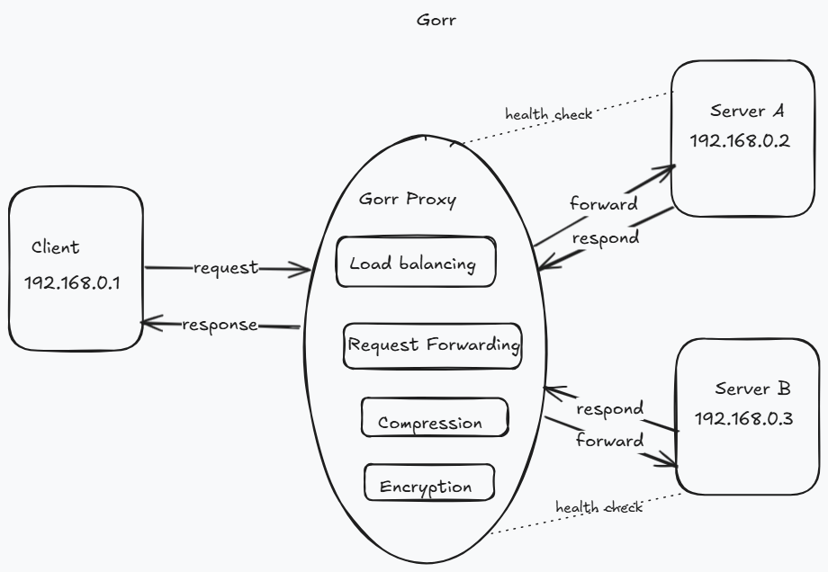

# Gorr

What if we could engineer ourselves into understanding how reverse proxies work. Gorr is the reverse proxy you never realized the need for.
A Go-based reverse proxy that routes HTTP requests to multiple upstream services based on URL prefixes similar to API gateways.
All you need is a config and a dream, lol.



_Gorr routes client requests to upstream services by matching URL prefixes (e.g., `/service1` → `http://localhost:8002`)._

## Features

-   **Prefix-Based Routing**: Routes requests to upstream services using URL prefixes (e.g., `/service1`, `/service2`).
-   **Sub-URL Handling**: Strips prefixes and forwards sub-URLs correctly (e.g., `/service1/api/resource` → `http://localhost:8002/api/resource`).
-   **Single Reverse Proxy per Service**: Each upstream service has a dedicated `ReverseProxy` for reliable forwarding.

## Prerequisites

-   Go 1.23 or later
-   [Gorilla Mux](https://github.com/gorilla/mux): `go get github.com/gorilla/mux`

## Installation

1. **Clone the Repository**:
    ```bash
    git clone github.com/mrshabel/gorr
    cd gorr
    # Install Dependencies:
    go mod tidy
    bash
    ```

## Usage

1. Run the Proxy: The proxy is configured with two upstream services by default:
    - /service1 → http://localhost:8002
    - /service2 → http://localhost:8003

```bash
go run .
bash
```

The proxy starts on localhost:8000.

2. Optionally start the example servers:

    ```go

    go run example/server.go 8002
    go run example/server.go 8003
    go
    ```

Two dummy servers will be stated on ports 8002 and 8003. Try a ping-pong by hitting `/ping`.

3. Test Requests: Assuming upstream services are running:

    ```bash
    curl http://localhost:8000/service1/ping
    curl http://localhost:8000/service2/data
    bash
    ```

    Requests to unknown prefixes (e.g., /service3) return a 404.

## Setup

Edit the services slice in main.go to add or modify upstream services:

```go
services := []UpstreamService{
{Name: "service1", GatewayPrefix: "/service1", URL: "http://localhost:8002"},
{Name: "service2", GatewayPrefix: "/service2", URL: "http://localhost:8003"},
}
go
```

## Running Tests

Gorr includes tests to verify routing and error handling using mock upstream services:

```bash
make test
bash
```

## Architecture

The architecture diagram (architecture.png) illustrates Gorr’s request flow:

1. Client sends a request to localhost:8000 with a prefix (e.g. /service1/api).
2. Gorr matches the prefix to an upstream service as specified in the config.
3. The prefix is stripped and the request gets forwarded to the upstream service (e.g. http://localhost:8002/api).
4. The upstream response is returned to the client.

## TODO

Planned features to enhance Gorr’s functionality:

1. Load Balancing: Support multiple URLs per upstream service with different load balancing strategies.
2. Circuit Breaking: Implement circuit breakers to handle upstream service failures gracefully.
3. TLS Support: Add HTTPS support for secure client and upstream communication.
